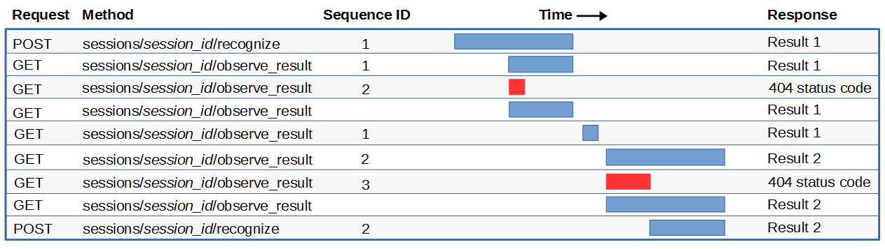

---

copyright:
  years: 2015, 2018
lastupdated: "2018-04-26"

---

{:shortdesc: .shortdesc}
{:new_window: target="_blank"}
{:tip: .tip}
{:pre: .pre}
{:codeblock: .codeblock}
{:screen: .screen}
{:javascript: .ph data-hd-programlang='javascript'}
{:java: .ph data-hd-programlang='java'}
{:python: .ph data-hd-programlang='python'}
{:swift: .ph data-hd-programlang='swift'}

# The HTTP REST interface
{: #http}

You can use the HTTP REST interface of the {{site.data.keyword.speechtotextshort}} service to transcribe audio with or without sessions. Sessionless recognition requests are simpler to use, but sessions enable more robust communication patterns and additional functionality. Note that the HTTP interface also provides the `GET /v1/models` and `GET /v1/models/{model_id}` methods, which you can use to learn the languages and models available for transcribing audio with methods from any of the service's interface.
{: shortdesc}

The HTTP interface, unlike the WebSocket interface, requires you to authenticate each call by using either your service credentials or a token. The WebSocket interface lets you establish and use a single authenticated connection indefinitely, and all audio and results travel over this single connection. The HTTP interface instead requires four distinct requests and connections to achieve the same results, and each request must be authenticated separately, incurring additional latency.

For information about tailoring recognition requests to suit your application's needs, see [Input features](/docs/services/speech-to-text/input.html) and [Output features](/docs/services/speech-to-text/output.html). For complete details about all methods of the HTTP interface, see the [API reference ](https://www.ibm.com/watson/developercloud/speech-to-text/api/v1/){: new_window}.

## Making sessionless requests
{: #HTTP-sessionless}

The {{site.data.keyword.speechtotextshort}} service provides a single sessionless method, `POST /v1/recognize`, with its HTTP interface. This method provides a simple means of transcribing audio without the overhead of establishing and maintaining a session. However, it can return transcription results only after all of the audio for the request has been processed; to obtain interim results, you must use either sessions or the WebSocket interface. Sessionless calls are appropriate for batch processing but not for live speech recognition.

The `POST /v1/recognize` method offers two ways of submitting a recognition request:

-   The first sends all of the audio in a single stream via the body of the request. You specify the parameters of the operation as request headers and query parameters.
-   The second sends the audio as a multipart request. You specify the parameters of the request as a combination of request headers and JSON metadata (see [Submitting multipart requests](#HTTP-multi)).

The following example sends a recognition request for a single FLAC file named `audio-file.flac`. The request omits the `model` query parameter to use the default language model, `en-US_BroadbandModel`.

```bash
curl -X POST -u {username}:{password}
--header "Content-Type: audio/flac"
--data-binary @{path}audio-file.flac
"https://stream.watsonplatform.net/speech-to-text/api/v1/recognize"
```
{: pre}

The method returns the following transcription results for the audio:

```javascript
{
  "results": [
    {
      "alternatives": [
        {
          "confidence": 0.891,
          "transcript": "several tornadoes touch down as a line of severe thunderstorms swept through Colorado on Sunday "
        }
      ],
      "final": true
    }
  ],
  "result_index": 0
}
```
{: codeblock}

## Making session-based requests
{: #HTTP-sessions}

The {{site.data.keyword.speechtotextshort}} service provides a number of session-based methods with its HTTP interface. Sessions provide a mechanism for a client to maintain a long, multi-turn exchange with the service or to establish multiple parallel conversations with a particular instance of the service. Sessions are available only for the service's HTTP interface. With the WebSocket interface, the concept of a session is implicit: the connection is the session.

The typical pattern for using sessions with the HTTP REST interface follows:

1.  *Create a session* by calling the `POST /v1/sessions` method. The method locks a transcription engine to the session. You can use the session to process multiple recognition requests with the same engine. Use the method's `model` query parameter to specify the language and model to be used for all requests sent within the session; by default, the session uses the model `en-US_BroadbandModel`.

    ```bash
    curl -X POST -u {username}:{password}
    --cookie-jar cookies.txt
    "https://stream.watsonplatform.net/speech-to-text/api/v1/sessions"
    ```
    {: pre}

    The method returns a cookie via the `Set-Cookie` header. You must pass the cookie with each request that uses the session (see [Using cookies with sessions](#cookies)).

    The method also returns the ID for the new session, the secure URI for the session, and the secure URLs for calls to the session's `GET /v1/sessions/{session_id}/observe_result` and `POST /v1/sessions/{session_id}/recognize` methods. (The method also returns the secure URL for calling the `/v1/recognize` method of the WebSocket interface; you do *not* use the WebSocket URL when interacting with the service's HTTP interface.)

    ```javascript
    {
      "recognize": "https://stream.watsonplatform.net/speech-to-text/api/v1/sessions/{session_id}/recognize",
      "recognizeWS": "wss://stream.watsonplatform.net/speech-to-text/api/v1/sessions/{session_id}/recognize",
      "observe_result": "https://stream.watsonplatform.net/speech-to-text/api/v1/sessions/{session_id}/observe_result",
      "session_id": {session_id}",
      "new_session_uri": "https://stream.watsonplatform.net/speech-to-text/api/v1/sessions/{session_id}"
    }
    ```
    {: codeblock}

1.  *To request interim results* for subsequent recognition requests with the `POST /v1/sessions/{session_id}/recognize` method, call the `GET /v1/sessions/{session_id}/observe_result` method and set the `interim_results` query parameter to `true`. Interim results are intermediate hypotheses that are likely to change before the service returns the final result; by default, the service returns only the final results (see [Interim results](/docs/services/speech-to-text/output.html#interim)).

    To enable polling when you transcribe long audio requests, specify a sequence ID with the `sequence_id` query parameter, and then specify the same sequence ID with the recognition request (see [Transcribing long audio files with sessions](#HTTP-long)).

    ```bash
    curl -X GET -u {username}:{password}
    --cookie cookies.txt
    "https://stream.watsonplatform.net/speech-to-text/api/v1/sessions/{session_id}/observe_result?interim_results=true"
    ```
    {: pre}

1.  *Submit a recognition request* by calling the `POST /v1/sessions/{session_id}/recognize` method. As with sessionless requests, you can send all of the audio in a single request stream via the body of the request or you can send the audio as a multipart request (see [Submitting multipart requests](#HTTP-multi)). Both approaches support the `sequence_id` parameter to enable polling of long requests. The following example, like its sessionless counterpart, omits the `model` query parameter to use the default value, `en-US_BroadbandModel`.

    ```bash
    curl -X POST -u {username}:{password}
    --cookie cookies.txt
    --header "Content-Type: audio/flac"
    --data-binary @{path}audio-file.flac
    "https://stream.watsonplatform.net/speech-to-text/api/v1/sessions/{session_id}/recognize"
    ```
    {: pre}

    The method returns the following transcription results for the audio, which do not include interim results:

    ```javascript
    {
      "results": [
        {
          "alternatives": [
            {
              "confidence": 0.891,
              "transcript": "several tornadoes touch down as a line of severe thunderstorms swept through Colorado on Sunday "
            }
          ],
          "final": true
        }
      ],
      "result_index": 0
    }
    ```
    {: codeblock}

1.  *Check whether the session can accept a new recognition request* by calling the `GET /v1/sessions/{session_id}/recognize` method. The service does not allow concurrent recognition tasks during the same session. The `GET /v1/sessions/{session_id}/recognize` method blocks until the session's state is `initialized`, indicating that it is ready to accept a new request.

    ```bash
    curl -X GET -u {username}:{password}
    --cookie cookies.txt
    "https://stream.watsonplatform.net/speech-to-text/api/v1/sessions/{session_id}/recognize"
    ```
    {: pre}

    In addition to the state of the session and the model that it uses, the method also returns the secure URLs for calls to the session's `POST /v1/sessions/{session_id}/recognize` and `GET /v1/sessions/{session_id}/observe_result` methods.

    ```javascript
    {
      "session": {
        "recognize": "https://stream.watsonplatform.net/speech-to-text/api/v1/sessions/{session_id}/recognize",
        "recognizeWS": "wss://stream.watsonplatform.net/speech-to-text/api/v1/sessions/{session_id}/recognize",
        "state": "initialized",
        "observe_result": "https://stream.watsonplatform.net/speech-to-text/api/v1/sessions/{session_id}/observe_result",
        "model": "https://stream.watsonplatform.net/speech-to-text/api/v1/models/en-US_BroadbandModel"
      }
    }
    ```
    {: codeblock}

1.  *Submit additional recognition requests.* You can continue to submit recognition requests and, if desired, observe interim results over the session as described in the previous steps. To continue using the session, you must avoid an inactivity or session timeout:
    -   An *inactivity timeout* occurs if audio is being sent by the client but the service detects no speech. The inactivity timeout is 30 seconds by default. You can use the `inactivity_timeout` parameter to specify a different value, including `-1` to set the timeout to infinity.
    -   A *session timeout* occurs if the service receives no data from the client or sends no interim results for 30 seconds. You cannot change the length of this timeout, but you can extend the session by sending the service any audio data, including just silence, before the timeout occurs. You must also set the `inactivity_timeout` to `-1`. You are charged for the duration of any data that you send to the service, including the silence that you send to extend a session.

    For more information, see [Timeouts](/docs/services/speech-to-text/input.html#timeouts).
1.  *Delete the session* when you are done with it by calling the `DELETE sessions/{session_id}` method. If you neglect to delete the session, the service closes the session when it times out due to 30 seconds of inactivity.

    ```bash
    curl -X DELETE -u {username}:{password}
    --cookie cookies.txt
    "https://stream.watsonplatform.net/speech-to-text/api/v1/sessions/{session_id}"
    ```
    {: pre}

## Using cookies with sessions
{: #cookies}

For session-based requests to succeed, the client must enable cookies. The initial `POST /v1/sessions` request to establish a session returns a cookie for the session via the `Set-Cookie` response header; the client must return the cookie with all requests that use the session. To exchange cookies with the service, the cURL examples provided for session-based requests use the following options:

-   The `--cookie-jar` (`-c`) option directs cURL to write the cookie that it receives from the service to the specified file (`cookies.txt`).
-   The `--cookie` (`-b`) option causes cURL to pass the cookie to the service. The command reads the cookie from the specified file.

Cookies are stored as key-value pairs in the cookie-jar file. For example, for a session with ID `3080818927c8b9d82c578404381dcf4b`, the service returns the following `Set-Cookie` request header with its response to the `POST /v1/sessions` method:

```bash
Set-Cookie: SESSIONID=3080818927c8b9d82c578404381dcf4b26832997; Secure; HttpOnly
```
{: pre}

The cURL executable stores the cookie in the cookie jar in the following format:

```bash
#HttpOnly_stream.watsonplatform.net     FALSE   /speech-to-text/api/v1/ TRUE
0       SESSIONID       3080818927c8b9d82c578404381dcf4b26832997
. . .
```
{: pre}

Subsequent session-based requests return the cookie to the service via the following header:

```bash
Cookie: SESSIONID=3080818927c8b9d82c578404381dcf4b26832997; . . .
```
{: pre}

In each case, the session ID is clearly identified in the cookie. (The service appends additional characters that it uses internally to the ID.) If you fail to pass the cookie with a request to a session-based method, the service returns the following error:

```javascript
{
  "error": "Cookie must be set.",
  "code": 400,
  "code_description": "Bad Request"
}
```
{: codeblock}

If you pass an invalid cookie with a request to a session-based method, the service returns the following error:

```javascript
{
  "error": "Session does not exist.",
  "code": 404,
  "code_description": "No Such Resource"
}
```
{: codeblock}

If you receive this error, you can compare the session ID to the value of the cookie that was passed to determine whether the error was caused by a bad cookie. The error can also be caused by an expired session, but the comparison can help you eliminate one source of failure.

## Transcribing long audio files with sessions
{: #HTTP-long}

When you transcribe long audio files with session-based methods, requests can time out if not handled properly. Timeouts cannot occur while data is being uploaded, but they can occur if the time between submitting the recognition request and observing the results is too long. The recommended means of submitting long audio files is to use the WebSocket interface, but you can overcome possible timeouts with the HTTP interface by using a long polling pattern with sessions.

The `GET /v1/sessions/{session_id}/observe_result` and `POST /v1/sessions/{session_id}/recognize` methods include a `sequence_id` parameter that lets you associate an arbitrary integer value with a recognition task. Including the same sequence ID with the methods gives you considerable latitude for when you call the `/v1/sessions/{session_id}/observe_result` method: You can poll the service by calling `/v1/sessions/{session_id}/observe_result` before, during, or after you call `/v1/sessions/{session_id}/recognize`. The method always returns the full transcription, including interim results if requested, regardless of when you call it.

When you specify matching sequence IDs with the methods, the call to the `/v1/sessions/{session_id}/observe_result` method either returns the results for the `/v1/sessions/{session_id}/recognize` request or times out. You can repeat the call to `/v1/sessions/{session_id}/observe_result` if it times out, but you must separate the calls by no more than 30 seconds. If the results are ready and no request for them arrives within 30 seconds, the service closes the session.

### Behavior with and without sequence IDs
{: #HTTP-long-behavior}

The following table describes the behavior of the `GET /v1/sessions/{session_id}/observe_result` and `POST /v1/sessions/{session_id}/recognize` methods when you call them both with and without sequence IDs, when the sequence IDs of the calls match, and when they do not. When you specify a sequence ID with the `/v1/sessions/{session_id}/observe_result` method, the `/v1/sessions/{session_id}/recognize` method must include the same sequence ID for the calls to match. If the `/v1/sessions/{session_id}/observe_result` call includes a sequence ID but the `/v1/sessions/{session_id}/recognize` call does not, the service does not consider the IDs as matching.

<table>
  <caption>Table 1. Behavior of methods with sequence IDs</caption>
  <tr>
    <th style="width:20%; text-align:left; vertical-align:bottom">
      The <code>observe_result</code> method...
    </th>
    <th style="width:20%; text-align:left; vertical-align:bottom">
      A recognition task...
    </th>
    <th style="text-align:left; vertical-align:bottom">
      Result
    </th>
  </tr>
  <tr>
    <td style="vertical-align:top">
      <em>1.</em> Includes a sequence ID
    </td>
    <td style="vertical-align:top">
      <em>A.</em> Is ongoing
    </td>
    <td style="vertical-align:top">
      <em>1. If the sequence ID matches the ongoing recognition task</em>,
      the service returns the results for the ongoing task.
      <br/><br/>
      <em>2. If the sequence ID does not match the ongoing recognition
        task</em>, the service returns a 404 status code.
    </td>
  </tr>
  <tr>
    <td></td>
    <td style="vertical-align:top">
      <em>B.</em> Is not ongoing
    </td>
    <td style="vertical-align:top">
      <em>1. If the sequence ID matches the previous recognition task</em>,
      the service returns the results for the previous task.
      <br/><br/>
      <em>2. If the sequence ID does not match the previous recognition
        task</em>, the call waits for the next recognition task. If the
      sequence ID matches the next task, the service returns the results
      for the next task; otherwise, it returns a 404 status code.
    </td>
  </tr>
  <tr>
    <td style="vertical-align:top">
      <em>2.</em> Does not include a sequence ID
    </td>
    <td style="vertical-align:top">
      <em>A.</em> Is ongoing
    </td>
    <td style="vertical-align:top">
      The service returns the results for the ongoing recognition task.
    </td>
  </tr>
  <tr>
    <td></td>
    <td style="vertical-align:top">
      <em>B.</em> Is not ongoing
    </td>
    <td style="vertical-align:top">
      The call waits for the next recognition task.
    </td>
  </tr>
</table>

The following figure shows examples of the behavior described in the previous table.



In the figure, the first `POST` request calls the `/v1/sessions/{session_id}/recognize` method with sequence ID **1** to initiate a recognition task. The task continues for the duration of time shown by the shaded blue bar. The following four `GET` requests to the `/v1/sessions/{session_id}/observe_result` method are associated with this first recognition task:

-   The first request with sequence ID **1** arrives while the task is ongoing. It matches the sequence ID of the ongoing task and succeeds, returning the results for the task when they are ready (case *1.A.1*).
-   The request with sequence ID **2** arrives while the task is ongoing. It does not match the sequence of the ongoing task and fails immediately, returning a 404 status code (case *1.A.2*).
-   The request with no sequence ID arrives while the task is ongoing. It succeeds, returning the results for the task when they are ready (case *2.A*).
-   The second request with sequence ID **1** arrives after the task completes and while no other task is ongoing. It matches the sequence ID of the previous task and succeeds, returning the results for the task immediately (case *1.B.1*).

The following three `GET` requests to the `/v1/sessions/{session_id}/observe_result` method are associated with the recognition task for the second `POST` request to the `/v1/sessions/{session_id}/recognize` method. This recognition task has a sequence ID of **2**. The three calls to the `/v1/sessions/{session_id}/observe_result` method respond as follows:

-   The request with sequence ID **2** arrives while no task is ongoing. It does not match the sequence ID of the previous task, so it waits. It matches the sequence ID of the next task and succeeds, returning the results for the task when they are ready (case *1.B.2* success).
-   The request with sequence ID **3** arrives while no task is ongoing. It does not match the sequence ID of the previous task, so it waits. It also does not match the sequence ID of the next task, so it fails as soon as the request for that task arrives, returning a 404 status code (case *1.B.2* failure).
-   The request with no sequence ID arrives while no task is ongoing. It waits for the next task and succeeds, returning the results for the task when they are ready (case *2.B*).

This example assumes that the requests arrive in a timely manner and that none of them times out due to inactivity.

## Submitting multipart requests as form data
{: #HTTP-multi}

Both the sessionless (`POST /v1/recognize`) and session-based (`POST /v1/sessions/{session_id}/recognize`) methods support two approaches for speech recognition:

-   With the *non-multipart* approach, you pass all audio via the body of the request and specify the parameters as request headers and query parameters. If your data consists of multiple audio files, the recommended means of submitting the audio is by sending multiple requests, one for each audio file. You can submit the requests in a loop, optionally with parallelism to improve performance.
-   With the *multipart* approach, you pass all audio data as multipart form data. You specify some parameters as request headers and query parameters, but you pass JSON metadata as form data to control most aspects of the transcription.

The multipart approach is intended for two use cases:

-   For use with browsers for which JavaScript is disabled. Multipart requests based on form data do not require the use of JavaScript.
-   When the parameters used with the recognition request are greater than the 8 KB limit imposed by most HTTP servers and proxies. This can occur, for example, if you want to spot a very large number of keywords. Passing the parameters as form data avoids this limit.

The following sections describe the parameters that you use for multipart requests and show an example request.

### Request headers, query parameters, and form data
{: #multipartParameters}

You specify the following parameters of multipart speech recognition as request headers, query parameters, and form data. Some parameters are available with both sessionless and session-based requests; others are specific to sessionless requests.

<table>
  <caption>Table 2. Request headers, query parameters, and form data</caption>
  <tr>
    <th style="text-align:left; width:20%">Parameter</th>
    <th style="text-align:center; width:40%">Sessionless</th>
    <th style="text-align:center; width:40%">Session-based</th>
  </tr>
  <tr>
    <td>
      <code>Content-Type</code>
      <br/><em>Header</em>
      <br/><em>String</em>
    </td>
    <td colspan="2" style="text-align:center">
      <em>Required.</em> Specify `multipart/form-data`.
    </td>
  </tr>
  <tr>
    <td>
      <code>metadata</code>
      <br/><em>Form data</em>
      <br/><em>Object</em>
    </td>
    <td colspan="2" style="text-align:center">
      <em>Required.</em> A JSON object that provides the transcription
      parameters for the request. The object must be the first part of
      the form data. The information describes the audio in the subsequent
      parts of the form data. See [JSON metadata](#multipartJSON).
    </td>
  </tr>
  <tr>
    <td>
      <code>upload</code>
      <br/><em>Form data</em>
      <br/><em>File</em>
    </td>
    <td colspan="2" style="text-align:center">
      <em>Required.</em> One or more audio files as the remainder of the
      form data for the request. All audio files must have the same format.
      With cURL, include a separate `--form` option for each file of the
      request.
    </td>
  </tr>
  <tr>
    <td>
      <code>Transfer-Encoding</code>
      <br/><em>Header</em>
      <br/><em>String</em>
    </td>
    <td colspan="2" style="text-align:center">
      <em>Optional.</em> If your request includes more than one audio file,
      specify `chunked` to stream the audio data to the service.
    </td>
  </tr>
  <tr>
    <td>
      <code>model</code>
      <br/><em>Query</em>
      <br/><em>String</em>
    </td>
    <td>
      <em>Optional.</em> The identifier of the model that is to be
      used for the request. The default is `en-US_BroadbandModel`.
    </td>
    <td>
      <em>Not applicable.</em> Passed with the `POST /v1/sessions`
      method.
    </td>
  </tr>
  <tr>
    <td>
      <code>customization_id</code>
      <br/><em>Query</em>
      <br/><em>String</em>
    </td>
    <td>
      <em>Optional.</em> The GUID of a custom language model that is
      to be used with the request.
    </td>
    <td>
      <em>Not applicable.</em> Passed with the `POST /v1/sessions`
      method.
    </td>
  </tr>
  <tr>
    <td>
      <code>acoustic_customization_id</code>
      <br/><em>Query</em>
      <br/><em>String</em>
    </td>
    <td>
      <em>Optional.</em> The GUID of a custom acoustic model that is
      to be used with the request.
    </td>
    <td>
      <em>Not applicable.</em> Passed with the `POST /v1/sessions`
      method.
    </td>
  </tr>
  <tr>
    <td>
      <code>base_model_version</code>
      <br/><em>Query</em>
      <br/><em>String</em>
    </td>
    <td>
      <em>Optional.</em> The version of the specified base model that
      is to be used with the request.
    </td>
    <td>
      <em>Not applicable.</em> Passed with the `POST /v1/sessions`
      method.
    </td>
  </tr>
</table>

For more information about the query parameters, see [Input features](/docs/services/speech-to-text/input.html).

### JSON metadata
{: #multipartJSON}

The JSON metadata that you pass with a multipart request can include the following fields:

-   `part_content_type` (string)
-   `data_parts_count` (integer)
-   `customization_weight` (number)
-   `inactivity_timeout` (integer)
-   `keywords` (string[&nbsp;])
-   `keywords_threshold` (number)
-   `max_alternatives` (integer)
-   `word_alternatives_threshold` (number)
-   `word_confidence` (boolean)
-   `timestamps` (boolean)
-   `profanity_filter` (boolean)
-   `smart_formatting` (boolean)
-   `speaker_labels` (boolean)
-   `sequence_id` (integer, *session-based requests only*)

Only the following two parameters are specific to multipart requests:

-   The `part_content_type` field is *required*. Specify the format (MIME type) of the audio in the following parts of the request. All audio files must be in the same format.
-   The `data_parts_count` field is *optional*. You can specify the number of audio files sent with the request. The service applies end-of-stream detection to the last (and possibly the only) data part. If you omit the parameter, the service determines the number of parts from the request.

All other parameters of the metadata are optional, as described in [Input features](/docs/services/speech-to-text/input.html) and [Output features](/docs/services/speech-to-text/output.html). For a summary of all available recognition parameters, see [Parameter summary](/docs/services/speech-to-text/summary.html).

### Example multipart request

The following cURL example shows how to pass a multipart recognition request with the sessionless `POST /v1/recognize` method. The request passes two audio files, **audio-file1.flac** and **audio-file2.flac**. The `metadata` parameter provides most parameters of the request; the `upload` parameters provide the audio files.

```bash
curl -X POST -u {username}:{password}
--header "Transfer-Encoding: chunked"
--form metadata="{\"part_content_type\":\"audio/flac\",
  \"data_parts_count\":2,
  \"timestamps\":true,
  \"word_alternatives_threshold\":0.9,
  \"keywords\":[\"colorado\",\"tornado\",\"tornadoes\"],
  \"keywords_threshold\":0.5}"
--form upload="@audio-file1.flac"
--form upload="@audio-file2.flac"
"https://stream.watsonplatform.net/speech-to-text/api/v1/recognize"
```

The following example shows an equivalent non-multipart request with the same sessionless `POST /v1/recognize` method:

```bash
curl -X POST -u {username}:{password}
--header "Content-Type: audio/flac"
--data-binary "@audio-file1.flac"
--data-binary "@audio-file2.flac"
"https://stream.watsonplatform.net/speech-to-text/api/v1/recognize?timestamps=true&word_alternatives_threshold=0.9&keywords=%22colorado%22%2C%22tornado%22%2C%22tornadoes%22&keywords_threshold=0.5"
```
